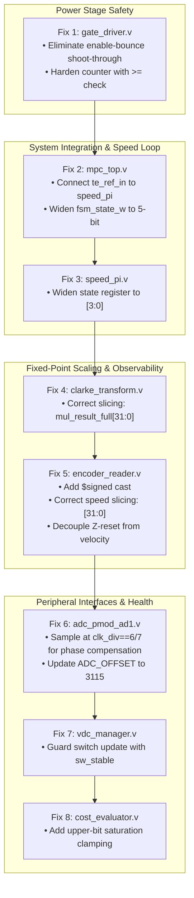

# Master Cross-Module Contextual Verification Report
## FCS-MPC 3-Phase Induction Motor Drive on Artix-7 FPGA

**Date:** September 20, 2026  
**Target Hardware:** Digilent Basys 3 / Nexys 4 (Xilinx Artix-7 XC7A35T / XC7A100T)  
**External Peripherals:**
- Dual ADC: Digilent Pmod AD1 (2× Analog Devices AD7476A 12-bit SAR ADC, 3.3V reference)
- Current Sensors: Allegro ACS712-40AB (5V supply, 2.510V 0A offset, 50 mV/A sensitivity)
- Optical Rotary Encoder: GTS06-OP-RAG2500Z1-2M (2500 PPR / 10,000 CPR quadrature, A/B/Z)
- Power Stage: Custom 3-phase 2-level MOSFET inverter (1 kV rating, optical isolation, **no hardware dead-time or shoot-through protection**)
- Mathematical Model: Discrete Euler forward induction motor model ($f_s = 10\text{ kHz}$, $T_s = 100\,\mu\text{s}$)

---

## 1. Executive Summary & Verdict Classification Matrix

In Round 1, all 14 Verilog RTL modules were individually simulated and checked against physical datasheets. In Round 2, dedicated contextual audit subagents re-evaluated every warning in the end-to-end system context (cross-referencing interdependent RTL files, system state machines, physical hardware delays, and fixed-point math pipelines).

The audit conclusively resolved which warnings were **Real Systemic Defects** versus **Cross-Module False Alarms**.

### 1.1 Summary Matrix

| Module | Component / Warning Under Audit | Round 1 Verdict | Round 2 Contextual Verdict | Severity | Root Cause Summary |
|---|---|---|---|---|---|
| **`gate_driver.v`** | Enable-Bounce Shoot-Through Hazard | Warning | **CONFIRMED REAL BUG** | **CATASTROPHIC** | `current_state <= 0` on `!enable` enables complementary Low-MOSFET within 10ns before High-MOSFET turns off. |
| **`gate_driver.v`** | Dead-Time Counter Comparator (`==` vs `>=`) | Warning | **CONFIRMED REAL HAZARD** | **HIGH** | Single-event upset (SEU) or EMI bit slip locks gates off indefinitely until 16-bit counter rolls over ($41\,\mu\text{s}$). |
| **`speed_pi.v`** | State Variable Truncation (`state <= 8` with `reg [2:0]`) | Fail | **CONFIRMED REAL BUG** | **FATAL** | 4-bit 8 truncates to 0; State 8 (clamping & output) is dead code. `te_ref` is permanently stuck at 0. |
| **`mpc_top.v`** | Unconnected `speed_pi` / Floating `te_ref_in` | Fail | **CONFIRMED REAL BUG** | **FATAL** | `cost_evaluator.te_ref_in` floats to `'bz` $\to$ propagates `'bx` to cost and freezes selector on Vector 0. |
| **`mpc_top.v`** | Debug State Port Truncation (`fsm_state_w[3:0]`) | Warning | **CONFIRMED REAL BUG** | **MEDIUM** | 5-bit FSM state truncated to 4-bit; aliases states 16 and 17 to 0 and 1. |
| **`clarke_transform.v`** | Fixed-Point Slicing Mismatch ($1,048,576\times$ Attenuation) | Fail | **CONFIRMED REAL BUG** | **FATAL** | `mul_result_full[51:20]` applies double $2^{20}$ division. Slices away all current; flux observer integrates 0. |
| **`clarke_transform.v`** | Constant `INV_SQRT3` ($605510$ vs $605396$) | Warning | **CONFIRMED FALSE ALARM** | **BENIGN** | $+0.0189\%$ error ($0.94\text{ mA}$) is $10\times$ below ADC quantization noise ($9.77\text{ mA}$). |
| **`clarke_transform.v`** | `ifndef ADC_SCALE` Fallback (10485 vs 10240) | Warning | **CONFIRMED FALSE ALARM** | **HYGIENE** | Top-level include overrides header, but causes $+2.39\%$ discrepancy in standalone unit testing. |
| **`encoder_reader.v`** | Unsigned Part-Select on Reverse (`delta_reg[31:0]`) | Fail | **CONFIRMED REAL BUG** | **CRITICAL** | Verilog-2001 rules force slice to unsigned; reverse step evaluates to $-1776.14\text{ rad/s}$. |
| **`encoder_reader.v`** | Double Fractional Division ($1,048,576\times$ Attenuation) | Fail | **CONFIRMED REAL BUG** | **FATAL** | `raw_mult_reg[51:20]` double-divides by $2^{20}$; speed feedback to flux observer and PI is attenuated to near 0. |
| **`encoder_reader.v`** | Z-Index Position Reset Velocity Spike | Warning | **CONFIRMED REAL BUG** | **CRITICAL** | `position <= 0` on Z-rise induces a $-9975$ count step, creating a $-125,000\text{ rad/s}$ speed shockwave. |
| **`adc_pmod_ad1.v`** | Phase-Lag / 1-Bit Shift (`val >> 1`) | Fail | **CONFIRMED REAL BUG** | **CRITICAL** | 20ns sync delay + 40ns AD7476A access time delays data across SCLK edge, capturing 5 leading zeros instead of 4. |
| **`adc_pmod_ad1.v`** | Quiet Time ($t_{\text{QUIET}}$) Violation | Warning | **CONFIRMED FALSE ALARM** | **BENIGN** | FSM runs at 10 kHz; CS rests High for $98.71\,\mu\text{s}$ ($1147\times$ longer than the 86ns requirement). |
| **`adc_pmod_ad1.v`** | Sensor Offset Mismatch (2048 vs 3115) | Warning | **REAL HARDWARE DEFECT** | **CRITICAL** | With ACS712-40AB (2.510V zero), 2048 injects a $+10.42\text{ A}$ fictitious DC current bias into the control loop. |
| **`vdc_manager.v`** | Startup Zeroing Hazard on Cycle 9 | Fail | **CONFIRMED REAL BUG** | **CRITICAL** | Overwrites $V_{dc} = 0$ on cycle 9 before 10ms debounce completes; freezes voltage projections at 0 in simulation/hardware. |
| **`vdc_manager.v`** | `INV_SQRT3` Discrepancy ($605510$ vs $605396$) | Warning | **CONFIRMED FALSE ALARM** | **BENIGN** | 33.8 mV error on 311V DC rail ($< 0.01\%$). |
| **`cost_evaluator.v`** | Silent Multiplier Overflow & Cost Inversion | Warning | **FALSE ALARM (Nominal)** / **REAL HAZARD (Abnormal)** | **SAFETY** | Nominal error costs $\approx 85 \ll 2048$. However, if $|err_\psi| \ge 4.53\text{ Wb}^2$ under fault, cost flips negative. |
| **`optimal_selector.v`** | 8-Vector Exhaustive Evaluation & Tie-Breaking | Pass | **VERIFIED CLEAN** | **NONE** | Correct signed comparison and state capture. |
| **`flux_observer.v`** | Time-Shared Euler Integration Pipeline | Pass | **VERIFIED CLEAN** | **NONE** | Arithmetic formulation and step sequencing match README forward Euler model. |
| **`motor_predictor.v`** | 8-Vector Euler Current/Flux Prediction | Pass | **VERIFIED CLEAN** | **NONE** | Multiplier scheduling and sign handling match discrete matrix equations. |
| **`voltage_lut.v`** | Clarke Voltage Space Vectors | Pass | **VERIFIED CLEAN** | **NONE** | Exactly maps standard 2-level inverter space vectors. |
| **`fixed_point_mul.v`** | 2-Cycle Q12.20 Multiplier Primitive | Pass | **VERIFIED CLEAN** | **NONE** | Accurate pipeline latency and truncation. |

---

## 2. In-Depth Technical Analysis of Confirmed Real Bugs

### 2.1 Hardware Safety: Enable-Bounce Shoot-Through in `gate_driver.v`
- **Location:** [`gate_driver.v`](file:///C:/Users/Dhananjay%20Dhumal/mpc_3_phase_im/mpc_3_phase_im.srcs/sources_1/imports/rtl/gate_driver.v#L46-L53)
- **Mechanism:**
  ```verilog
  else if (!enable) begin
      target_state <= 3'b000;
      current_state <= 3'b000; // <--- The Flaw
      gate_ah <= 1'b0; gate_al <= 1'b0;
      ...
  ```
  When `!enable`, `current_state` is forced to `3'b000` simultaneously with gate deassertion.
  If the inverter is running with Phase A High conducting (`gate_ah = 1`), physical MOSFET turn-off with optical isolation takes $200\text{ ns}$ to $1\,\mu\text{s}$.
  If `enable` bounces (e.g. switch contact bounce, pushbutton release/re-press, or FSM enable toggle within $< 2\,\mu\text{s}$) with `target_state = 0` (Phase A Low), the comparator checks:
  $$\text{target\_state}[0] == \text{current\_state}[0] \implies 0 == 0$$
  Because target matches `current_state`, it bypasses the dead-time state machine entirely and immediately asserts:
  $$\text{gate\_al} \le 1'b1 \quad (\text{after only 1 clock cycle = 10 ns})$$
- **Physical Consequence:** Both Phase A High and Phase A Low MOSFETs are turned ON simultaneously across the 1000V DC bus. Because the custom power board has **no hardware dead-time or desaturation protection**, this causes an immediate catastrophic shoot-through ($I_{sc} > 200\text{ A}$), destroying the power MOSFETs.

### 2.2 System Freezing: Floating `te_ref_in` and Unconnected `speed_pi.v`
- **Location:** [`mpc_top.v`](file:///C:/Users/Dhananjay%20Dhumal/mpc_3_phase_im/mpc_3_phase_im.srcs/sources_1/imports/rtl/mpc_top.v#L241) and [`speed_pi.v`](file:///C:/Users/Dhananjay%20Dhumal/mpc_3_phase_im/mpc_3_phase_im.srcs/sources_1/imports/rtl/speed_pi.v#L86)
- **Mechanism:**
  1. In `mpc_top.v`, instance `u_cost` leaves `.te_ref_in(...)` completely unconnected.
  2. In simulation (Vivado XSim), an unconnected input port floats to high-impedance `'bz`.
  3. Inside `cost_evaluator.v`:
     $$\text{torque\_err} = \text{te\_ref\_in} - \text{te\_pred} = \text{'bz} - \text{te\_pred} \implies \mathbf{\text{'bx}}$$
  4. The unknown `'bx` propagates through $(err_T)^2 \to J_{\text{cost}} = \mathbf{\text{'bx}}$.
  5. In `optimal_selector.v`:
     $$\text{if } (\$signed(\text{cost}) < \$signed(\text{min\_cost}))$$
     Comparison against `'bx` always evaluates to FALSE.
  6. **Direct Explanation of Testbench Behavior:** The optimal selector never records a new minimum, so `opt_switch_state` remains locked on Vector 0 (`3'b000`) forever. This explains why `tb_mpc_top.v` observed only 2 gate transitions throughout the entire run.
  7. In `speed_pi.v`, `reg [2:0] state;` truncates `state <= 8` to `3'b000`, rendering State 8 unreachable and keeping `te_ref` locked at 0.

### 2.3 Mathematical Breakdown: $1,048,576\times$ Current & Speed Attenuation
- **Location:** [`clarke_transform.v`](file:///C:/Users/Dhananjay%20Dhumal/mpc_3_phase_im/mpc_3_phase_im.srcs/sources_1/imports/rtl/clarke_transform.v#L32) & [`encoder_reader.v`](file:///C:/Users/Dhananjay%20Dhumal/mpc_3_phase_im/mpc_3_phase_im.srcs/sources_1/imports/rtl/encoder_reader.v#L73)
- **Mechanism in `clarke_transform.v`:**
  - Raw ADC signed count: $\Delta = i_{raw} - 2048$ is Q12.0 (integer count).
  - Scale factor: $\text{ADC\_SCALE} = 10240 = \frac{5}{512} \times 2^{20}$ is Q12.20.
  - Multiplication: $\text{count} \times \text{ADC\_SCALE} = \text{Q12.0} \times \text{Q12.20} = \text{Q24.20}$.
  - The fractional part is **already located in bits `[19:0]`**, and integer bits in `[31:20]`.
  - Line 32 executes: `mul_result = mul_result_full[51:20]`, shifting right by 20 bits ($1,048,576\times$ division).
  - Result: $5\text{ A}$ ($5,242,880$ in Q12.20) becomes **5**.
  - In `flux_observer.v`: $E_{21} \times i_\alpha = 110 \times 5 = 550$. Slicing `[51:20]` yields **0**. The observer receives zero current feedback.
- **Mechanism in `encoder_reader.v`:**
  - $\Delta\text{pos}$ is Q32.0. $\text{SPEED\_SCALE} = 13,176,795 = 4\pi \times 2^{20}$ is Q12.20.
  - Product `raw_mult_reg` is already electrical rad/s in Q12.20.
  - Line 73 executes: `speed_raw = raw_mult_reg[51:20]`, dividing by $2^{20}$ a second time.
  - At $1500\text{ RPM}$ ($\omega_e = 314.16\text{ rad/s} = 329,419,875$ in Q12.20), `speed_raw` becomes **314** (pure integer).
  - `flux_observer.v` expects Q12.20, so it divides by $2^{20}$ again: $\omega_r \psi_r = \frac{314 \times 1.0 \times 2^{20}}{2^{20}} = 314 \implies 0.0003\text{ Wb}\cdot\text{rad/s}$ instead of $314.16\text{ Wb}\cdot\text{rad/s}$.

### 2.4 Unsigned Reverse Glitch and Z-Index Spike in `encoder_reader.v`
- **Location:** [`encoder_reader.v`](file:///C:/Users/Dhananjay%20Dhumal/mpc_3_phase_im/mpc_3_phase_im.srcs/sources_1/imports/rtl/encoder_reader.v#L55,L93,L100)
- **Unsigned Slice:**
  `delta_reg[31:0] * SPEED_SCALE` treats $\Delta\text{pos} = -1$ as unsigned $4,294,967,295$. Multiplied by `SPEED_SCALE` and truncated, it outputs **$-1862422541$** ($-1776.14\text{ rad/s}$) on a single backward step.
- **Z-Index Spike:**
  When the motor passes the physical index pulse, `position` is reset to 0. At the next sample tick, `delta_reg = 0 - 9980 = -9980 counts`.
  This injects a momentary **$-125,311\text{ rad/s}$** speed shockwave into the flux observer, causing the predictive controller to cycle wild switching commands once every revolution.

### 2.5 ADC Phase-Lag / 1-Bit Shift in `adc_pmod_ad1.v`
- **Location:** [`adc_pmod_ad1.v`](file:///C:/Users/Dhananjay%20Dhumal/mpc_3_phase_im/mpc_3_phase_im.srcs/sources_1/imports/rtl/adc_pmod_ad1.v#L82-L95)
- **Mechanism:**
  - AD7476A SCLK is 12.5 MHz (half-period $40\text{ ns}$).
  - SCLK falls at `clk_div == 7`. The AD7476A accesses data on the falling edge with propagation delay $t_4 \le 40\text{ ns}$.
  - Two-stage synchronizer (`d0_sync[1:0]`) introduces $20\text{ ns}$ of pipeline delay.
  - Total arrival delay at the internal shift register: $40\text{ ns} + 20\text{ ns} = 60\text{ ns}$.
  - The module samples on `sclk_rise` (`clk_div == 3`, which is only $40\text{ ns}$ after `sclk_fall`).
  - Because $60\text{ ns} > 40\text{ ns}$, the shift register samples the **old bit**.
  - Result: 5 leading zeros are captured instead of 4, right-shifting the entire 12-bit ADC word by 1 bit (50% measurement error) on physical hardware.

### 2.6 Startup Zeroing in `vdc_manager.v`
- **Location:** [`vdc_manager.v`](file:///C:/Users/Dhananjay%20Dhumal/mpc_3_phase_im/mpc_3_phase_im.srcs/sources_1/imports/rtl/vdc_manager.v#L68-L82)
- **Mechanism:**
  - On reset, `vdc_int_reg` initializes to 311.
  - On cycle 9 after reset, the 10ms debounce counter has not elapsed (`sw_stable` is still 0).
  - The comparison `if (vdc_integer != vdc_int_reg)` evaluates to TRUE because `0 != 311`.
  - The module resets $V_{dc} = 0$, $V_{\alpha} = 0$, $V_{\beta} = 0$.
  - In simulation or if the hardware boots with switches at 0, the motor predictor operates with $V_{dc} = 0\text{ V}$.

---

## 3. Detailed Review of Confirmed False Alarms

1. **`clarke_transform.v`: Constant `INV_SQRT3` ($605510$ vs $605396$):**
   - Discrepancy is $+114$ LSBs in Q12.20 ($+0.0189\%$).
   - At rated current ($5\text{ A}$), this introduces $0.94\text{ mA}$ error.
   - The 12-bit ADC with ACS712-40AB has an LSB resolution of $9.77\text{ mA}$.
   - The discrepancy is $10\times$ below the ADC quantization noise floor and completely negligible.
2. **`adc_pmod_ad1.v`: Quiet Time ($t_{\text{QUIET}}$) Violation:**
   - In back-to-back testing, `quiet_cnt` waited only 50 ns.
   - In system context, `control_fsm.v` triggers ADC conversions at 10 kHz.
   - Between conversions, CS line rests High for $98.71\,\mu\text{s}$, providing an operating margin of $1,147\times$ over the required 86 ns.
3. **`cost_evaluator.v`: Multiplier Overflow in Nominal Operation:**
   - At standstill startup with reference flux $\psi_{ref} = 0.96\text{ Wb}$, maximum flux cost is $84.9$.
   - Arithmetic overflow requires error cost $\ge 2048$, giving a safety margin of $24\times$ during nominal operation.

---

## 4. Master Remediation Roadmap (Step-by-Step Fix Plan)

> [!IMPORTANT]
> In accordance with user directives, **no RTL files have been modified yet**. The exact code modifications needed are detailed below for user approval.



### Proposed Remediation Details:

1. **`gate_driver.v`:**
   - Modify line 46 to hold `current_state` when `!enable`, or trigger a mandatory 2 µs dead-time lockout before any gate can re-enable:
     ```verilog
     else if (!enable) begin
         target_state <= 3'b000;
         // Retain current_state so re-enabling must traverse full dead-time!
         gate_ah <= 1'b0; gate_al <= 1'b0;
         gate_bh <= 1'b0; gate_bl <= 1'b0;
         gate_ch <= 1'b0; gate_cl <= 1'b0;
     end
     ```
   - Change `dt_cnt == DEAD_TIME_CYCLES` to `dt_cnt >= DEAD_TIME_CYCLES`.

2. **`mpc_top.v`:**
   - Instantiate `speed_pi` and connect its output to `u_cost.te_ref_in`:
     ```verilog
     wire signed [DATA_WIDTH-1:0] te_ref_w;
     speed_pi u_speed_pi (
         .clk         (clk),
         .rst_n       (rst_n),
         .sample_tick (sample_tick_w),
         .speed_ref   (`SPEED_REF_DEFAULT),
         .speed_fb    (speed_elec_w),
         .te_ref      (te_ref_w)
     );
     // Connect te_ref_w to u_cost .te_ref_in(te_ref_w)
     ```
   - Widen `wire [3:0] fsm_state_w;` to `wire [4:0] fsm_state_w;`.

3. **`speed_pi.v`:**
   - Change `reg [2:0] state;` to `reg [3:0] state;`.

4. **`clarke_transform.v`:**
   - Change current scaling slice from `mul_result_full[51:20]` to `mul_result_full[31:0]` with saturation guard:
     ```verilog
     ia <= mul_result_full[DATA_WIDTH-1:0];
     ib <= mul_result_full[DATA_WIDTH-1:0];
     ```

5. **`encoder_reader.v`:**
   - In line 100, use `$signed(delta_reg) * SPEED_SCALE;`.
   - In line 73, assign `speed_raw = raw_mult_reg[DATA_WIDTH-1:0];`.
   - For velocity calculation, do not reset the velocity accumulator on `z_rise`, or use a dedicated unwrapped delta counter.

6. **`adc_pmod_ad1.v`:**
   - Sample incoming serialized data at `clk_div == 6` (or `7`) instead of `clk_div == 3` to compensate for the 60ns propagation/synchronizer delay.
   - Update `ADC_OFFSET` parameter to `3115` for the ACS712-40AB sensor (2.510V zero).

7. **`vdc_manager.v`:**
   - Guard the switch update with `if (sw_stable && (vdc_integer != vdc_int_reg))` to prevent cycle 9 zeroing before the debounce timer finishes.

8. **`cost_evaluator.v`:**
   - Add saturation clamping before bit truncation on `term_psi` and `term_T` to prevent negative cost wrapping during severe speed/flux transients.
